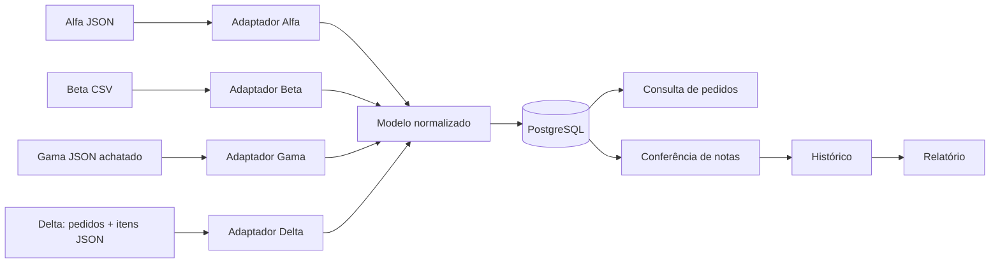

# Arquitetura

## Visão geral

O serviço é um monólito modular. Essa escolha mantém implantação e operação simples para o tamanho do problema, sem misturar as particularidades de cada cliente com as regras centrais.



## Pacotes

```text
application/       casos de uso de consulta, conferência e relatório
domain/model/      modelo normalizado e regras locais
domain/repository/ contratos de acesso aos agregados
integration/alfa/ contrato externo e transformação do Alfa
integration/beta/ leitura, associação e transformação dos CSVs Beta
integration/gama/ agrupamento e transformação das linhas Gama
integration/delta/ correlação entre pedidos e itens de fontes separadas
infrastructure/    HTTP, configuração e persistência Spring
```

Os modelos recebidos dos clientes não são retornados pela API e não são utilizados pela conferência. Cada adaptador converte sua entrada para `PurchaseOrder` e `PurchaseOrderItem`.

## Fluxo de importação

1. O controller recebe e valida a estrutura básica da carga.
2. O adaptador interpreta o formato específico do cliente.
3. O mapper normaliza data, CNPJ, situação, moeda, unidade, quantidade e preço.
4. O serviço procura o pedido por `source + number`.
5. Um pedido inexistente é criado; um pedido existente é substituído pela versão mais recente.
6. O PostgreSQL protege unicidade, integridade referencial e limites básicos.

A importação é transacional para erros estruturais ou de domínio. No Delta, item sem cabeçalho correspondente é uma rejeição controlada (`ORPHAN_ITEM`): pedidos válidos continuam sendo gravados e o resumo informa importados e rejeitados.

## Consultas e paginação

Pedidos são ordenados pelo primeiro instante de importação em ordem crescente e pelo identificador como desempate. Na primeira página, a API materializa essa sequência e os resumos em `purchase_order_scans` e devolve um `snapshotId`. As páginas seguintes usam o mesmo identificador e os mesmos filtros, portanto novas importações e atualizações de pedidos existentes não deslocam, duplicam ou removem elementos da varredura. Os snapshots expiram após 24 horas e a limpeza ocorre ao iniciar uma nova consulta.

O relatório não precisa materializar os registros porque conferências são imutáveis. Ele usa `snapshotAt`, ordenação por instante de validação decrescente e identificador como desempate.

## Fluxo de conferência

1. A requisição identifica o pedido por origem e número.
2. O CNPJ é normalizado.
3. Situação, fornecedor e itens são comparados com o pedido.
4. Linhas repetidas da nota que apontam para o mesmo item são somadas.
5. Todas as divergências detectáveis são retornadas juntas.
6. Requisição, resultado e divergências são persistidos como histórico imutável.

A conferência não atualiza `quantityReceived`. O sistema de origem permanece responsável pelo saldo, evitando baixa duplicada quando a mesma nota é reenviada.

## Consistência monetária

- Quantidades e valores usam `BigDecimal`.
- O total esperado é `quantidade × preço unitário`.
- O valor é arredondado para duas casas com `HALF_UP`.
- Diferenças de até R$ 0,01 são toleradas.

## Persistência

Flyway controla o schema e Hibernate usa `ddl-auto=validate`. Assim, a aplicação falha na inicialização se entidades e banco divergirem. O H2 dos testes opera em modo PostgreSQL e também executa as migrations.

## Extensão para novos clientes

Um novo cliente deve adicionar seu contrato de entrada, parser quando necessário, mapper e endpoint de ingestão. Consulta, conferência, relatório e tabelas normalizadas não devem precisar conhecer o novo formato.

Gama e Delta foram incluídos depois da tag `parte-1`, permitindo comparar objetivamente o impacto da mudança. Consulte `docs/part-2-impact.md`.

## Trade-offs da Parte 1

- As entidades de domínio também são entidades JPA para evitar duplicação de modelos e mappers neste escopo.
- A importação é síncrona e atômica; filas e processamento em lotes seriam considerados para volumes muito altos.
- Não há autenticação, pois ela não faz parte do problema apresentado.
- O identificador da nota não foi fornecido; por isso, cada chamada executável gera um novo histórico.
