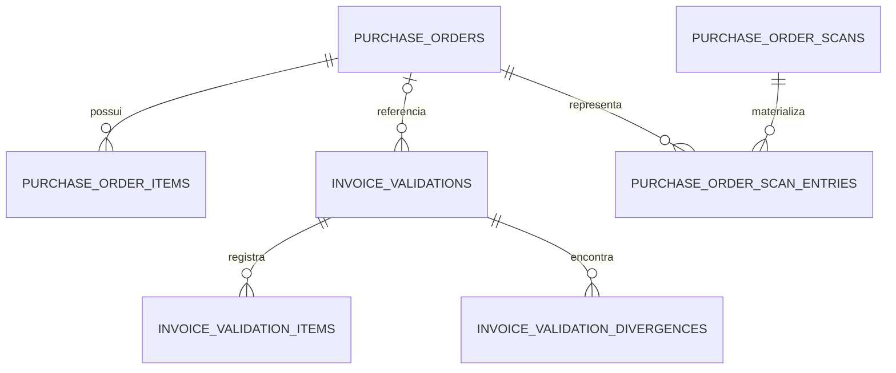

# Desenho do banco de dados

## Estratégia

O PostgreSQL guarda um modelo único, independente do formato recebido de Alfa, Beta, Gama ou Delta. Cada adaptador normaliza a carga antes da persistência. O schema é versionado pelo Flyway e o Hibernate usa `ddl-auto=validate`, portanto a aplicação não altera tabelas implicitamente e falha ao iniciar caso entidades e banco estejam incompatíveis.

## Pedido e itens

`purchase_orders` representa o cabeçalho do pedido. A chave primária técnica é um UUID (`id`). A chave de negócio é a restrição única `(source, order_number)`, pois clientes diferentes podem utilizar o mesmo número. Ela também torna a reimportação idempotente: uma nova carga localiza o registro existente e substitui seus dados em vez de criar outro pedido.

O cabeçalho preserva origem, número, data, situação, moeda e fornecedor. `imported_at` indica a carga mais recente; `first_imported_at` permanece fixo e participa da ordenação estável.

`purchase_order_items` representa as linhas e possui relação muitos-para-um com o pedido. A chave `(purchase_order_id, line_number)` impede duas linhas iguais dentro do mesmo pedido. A FK usa `ON DELETE CASCADE`, então a remoção de um pedido não deixa itens órfãos. Quantidades e preços usam `NUMERIC(19,6)` para evitar erros de ponto flutuante.

As restrições garantem que:

- quantidades pedida e recebida não sejam negativas;
- a quantidade recebida não ultrapasse a pedida;
- o preço unitário não seja negativo;
- o fator de conversão, quando informado, seja positivo.

Os campos `source_purchase_unit`, `source_conversion_factor` e `source_purchase_unit_price` preservam os valores originais usados na conversão da Gama. `source_created_at` guarda a data própria do item Delta.

## Conferências de notas

`invoice_validations` é um histórico imutável da conferência. Ele pode apontar para um pedido, mas a FK é opcional porque a própria ausência do pedido é uma divergência válida. O registro também mantém origem, número e CNPJ normalizado como snapshot do que foi conferido.

`invoice_validation_items` preserva os itens recebidos na requisição. `invoice_validation_divergences` guarda todas as diferenças detectadas, incluindo tipo, mensagem, linha, material e valores esperado e recebido. Ambas usam `ON DELETE CASCADE` em relação à conferência.

## Paginação estável

`purchase_order_scans` registra os filtros e o instante de criação de uma varredura. `purchase_order_scan_entries` materializa, por posição, o resumo de cada pedido encontrado. As restrições `(scan_id, position)` e `(scan_id, purchase_order_id)` impedem posições ou pedidos repetidos. Assim, importações concorrentes não deslocam registros entre páginas.

Os snapshots expiram após 24 horas e são removidos quando uma nova consulta é iniciada.

## Índices

- `idx_purchase_orders_filter_order`: atende filtros por origem, situação e fornecedor, além da ordenação.
- `idx_purchase_orders_stable_order` e `idx_purchase_orders_snapshot_order`: sustentam ordenação determinística e criação do snapshot.
- `idx_purchase_order_items_pending`: ajuda o filtro de pedidos com saldo.
- `idx_purchase_order_items_material_code`: auxilia a busca e conferência por material.
- `idx_invoice_validations_report_order` e `idx_invoice_validations_report_filters`: atendem o relatório paginado e seus filtros.
- `idx_validation_divergences_type`: permite analisar divergências por categoria.
- `idx_purchase_order_scan_created_at`: facilita a expiração dos snapshots.
- `idx_purchase_order_scan_entries_page`: permite buscar uma página por `scan_id` e posição.

## Reimportação e transações

As importações executam em transação. Erros estruturais desfazem a carga inteira, com exceção da regra explícita do Delta: itens sem cabeçalho são rejeitados individualmente e os pedidos válidos continuam. Ao reimportar, o agregado existente é atualizado e seus itens são sincronizados; a restrição da chave de negócio protege contra duplicidade mesmo diante de erro de aplicação.

Todas as alterações do schema estão em `src/main/resources/db/migration`, atualmente das migrations V1 a V7.
